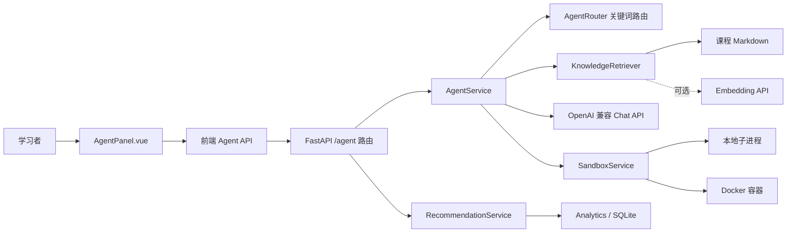
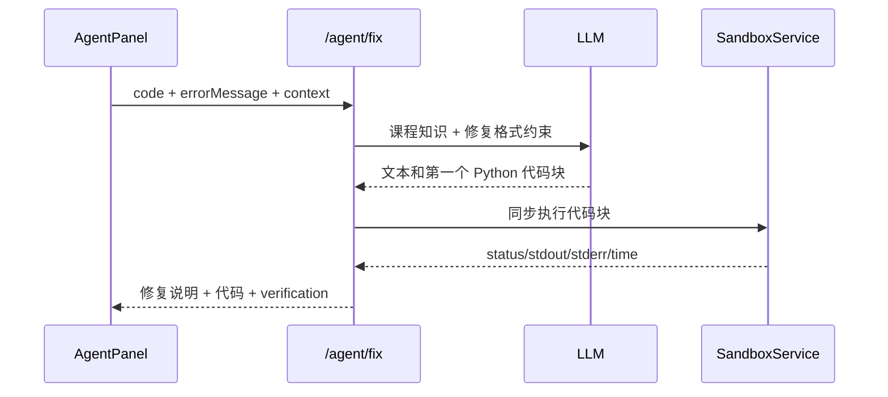

# Learn DA Agent 整体功能与工作流程审查报告

> 审查日期：2026-07-14  
> 审查基线：`main` / `5f1f1b8`  
> 审查范围：Agent 前后端、知识检索、代码沙箱、学习推荐、行为分析、部署配置与相关测试

## 1. 执行摘要

当前实现更准确的定位是：**带课程上下文、知识检索和确定性降级的单轮 LLM 教学助手**。它已经具备问答、代码解释、代码修复、练习生成、下一步建议和规则推荐解释等完整的用户入口，但并不是 README 所描述的“OpenAI Function Calling Agent”，也不具备自主规划、多步工具调用或执行反馈循环。

总体判断：

| 维度 | 结论 |
| --- | --- |
| 功能可用性 | 教学问答主链路已成形，直接解释/修复和推荐解释可用 |
| Agent 自主性 | 低；规则路由只选择回复模板，不调用声明式工具 |
| 上下文能力 | 有限短期上下文 + 课程/代码/输出注入；第 4 轮普通对话会触发校验错误 |
| 知识增强 | 支持关键词和可选 embedding，但中文召回及缓存生命周期存在明显问题 |
| 安全性 | **不满足公开生产要求**；生产默认本地执行不可信代码，前端还存在未净化 HTML 渲染 |
| 可靠性 | 有确定性 fallback，但超时、重试、错误分类、取消、并发隔离不足 |
| 可观测性 | 只有 HTTP 访问日志；缺少模型、路由、检索、token、成本和 fallback 原因指标 |
| 测试 | 后端现有 79 项测试通过；前端无自动化测试，缺少 Agent E2E、安全与并发测试 |

**发布建议：内部可信环境可继续试用；在修复 R-01、R-02、R-03 之前，不建议暴露到公网或处理真实密钥/数据。**

## 2. 审查方法与验证

本次按“入口 -> 编排 -> 外部适配器 -> 状态 -> 反馈闭环 -> 部署”的顺序进行静态审查，并执行以下验证：

- 后端：`.venv/Scripts/python.exe -m pytest -q --basetemp=.pytest_tmp`，结果 `79 passed`。
- 前端：`npm run build`，类型检查与 Vite 生产构建均通过。
- 边界复现：7 条 history 会被 `AgentChatRequest` 以 `too_long` 拒绝。
- 安全复现：`pathlib.Path` 目录访问代码会被当前 `validate_code()` 判定为安全。
- 检索复现：中文句子“函数的参数有什么作用”无关键词结果，单词“参数”可以命中同一知识块。

本报告不评价真实模型回答质量，因为当前环境没有调用外部 LLM，也没有项目级离线评测集。

## 3. 当前系统结构

主要模块职责：

| 模块 | 当前职责 | 评价 |
| --- | --- | --- |
| [`AgentPanel.vue`](../../learn_da_vue/src/components/agent/AgentPanel.vue#L35) | 汇集 Playground/课程上下文、维护内存消息、快捷动作、渲染回答 | 功能集中但文件接近 1000 行，状态、网络和渲染耦合较深 |
| [`agent.ts`](../../learn_da_vue/src/api/agent.ts#L14) | chat/fix/explain/guidance 请求封装 | chat 实际为非流式整包返回 |
| [`router.py`](../app/agent/router.py#L27) | 4 个 Agent HTTP 入口和依赖组装 | 接口小，但每请求重建重型依赖 |
| [`service.py`](../app/agent/service.py#L34) | 路由、检索、prompt、LLM、解析、修复验证编排 | 核心模块职责清楚，外部调用策略过薄 |
| [`routing.py`](../app/agent/routing.py#L14) | 按关键词选择 6 种工具名 | 是意图标签器，不是工具执行器 |
| [`tools.py`](../app/agent/tools.py#L105) | 每类回复的格式要求和 fallback | 名称为 tools，实际没有工具 schema 或可调用函数 |
| [`knowledge.py`](../app/agent/knowledge.py#L62) | 课程切块、关键词/向量检索、知识块拼装 | 有降级能力，但缓存只活在单次请求对象内 |
| [`SandboxService`](../app/sandbox/service.py#L14) | 安全检查并选择本地、Docker 或 mock runner | 生产默认和安全检查不足以隔离不可信代码 |
| [`RecommendationService`](../app/learning/recommendation.py#L119) | 顺学、回补、分支、回流规则 | 推荐排序保持确定性，是正确的职责划分 |

从模块深度看，`AgentService.chat/fix_code/explain_code/recommendation_guidance` 提供了较小的外部接口，内部隐藏了较多编排细节，方向合理；但 LLM、检索器和沙箱的生命周期、错误语义与性能特征仍泄漏为调用方难以预测的行为。

## 4. 实际功能清单

| 功能 | HTTP 入口 | 实际行为 |
| --- | --- | --- |
| 通用问答 | `POST /api/v1/agent/chat` | 关键词选回复格式，检索最多 3 个知识块，调用一次 LLM；失败返回固定文本 |
| 示例代码 | 同上 | 路由到 `generate_example_code` 格式，模型生成文本；没有执行工具 |
| 练习生成 | 同上 | 路由到 `generate_exercise` 格式，强调先提示后答案 |
| 下一步建议 | 同上 | 根据前端传入的课程/代码/输出让模型生成建议，不读取规则推荐系统 |
| 代码解释 | `POST /api/v1/agent/explain` | 检索知识后调用一次 LLM，返回解释和正则解析的结构化分段 |
| 代码修复 | `POST /api/v1/agent/fix` | 让 LLM 输出一个代码块，取第一个代码块并同步执行验证 |
| 推荐解释 | `POST /api/v1/agent/recommendation-guidance` | 规则引擎先选课程，LLM 只解释原因并生成 5-10 分钟练习 |
| 降级 | 全部入口 | 无 API key、异常或空回答时返回确定性 fallback |

两个容易混淆的事实：

1. `/agent/chat` 即使命中 `fix_code`，也只改变 prompt 格式，不会调用 `/agent/fix` 或执行沙箱。
2. `OPENAI_MAX_TURNS` 只控制取多少条历史消息，不代表模型与工具之间的最大执行轮数。

## 5. 核心工作流程

### 5.1 普通对话

1. 前端从 Playground store 和页面 props 组合当前代码、课程、stdout、stderr。
2. `AgentPanel` 把用户消息加入本地数组，再构造 history。
3. 后端 `AgentRouter` 按固定优先级匹配关键词并选择工具名。
4. `KnowledgeRetriever` 优先尝试 embedding，异常时静默回退关键词检索。
5. prompt 由系统规则、上下文、知识块、最近历史和回复格式组成。
6. `_ask_llm()` 发起一次非流式 `chat.completions.create`。
7. 成功时用正则抽取标题段和代码块；失败时返回该工具的固定 fallback。
8. 前端忽略 `structuredResult`，仍把 Markdown 转为 HTML 后通过 `v-html` 渲染。

### 5.2 代码修复与验证

该流程的优点是“建议”后面有运行反馈；主要问题是未经用户确认自动执行模型输出，且默认 runner 在生产 Compose 中仍是后端容器内的本地 Python 子进程。

### 5.3 规则推荐解释

1. 前端发送浏览器 visitor ID、本地完成课程列表和当前课程。
2. `RecommendationService` 按回补 -> 分支 -> 回流 -> 顺学的优先级选出确定性建议。
3. Analytics 只参与回补和回流信号，不把排序权交给模型。
4. LLM 把规则理由改写为解释并生成小练习；不可用时返回固定解释。

这条链路的决策与生成分离是当前设计中最稳健的部分，但行为事件和冷却状态没有真正闭环，见 R-06。

## 6. 做得较好的部分

- **确定性降级**：无密钥或模型异常时仍能返回结构稳定、面向学习任务的内容。
- **推荐决策可解释**：模型不参与课程排序，避免推荐结果随生成随机性漂移。
- **上下文边界存在**：Pydantic 对消息、代码、错误和课程内容设置了长度上限。
- **依赖可替换**：`AgentService` 可注入 router、retriever、sandbox 和 recommendation service，单元测试容易隔离。
- **修复结果有验证字段**：调用方能区分模型声称修复与实际运行是否成功。
- **Docker runner 有基础约束**：包含无网络、只读根文件系统、内存/CPU/超时和临时目录限制。
- **后端单元测试覆盖主分支**：路由、fallback、prompt 格式、检索注入、结构化解析和沙箱结果均已有测试。

## 7. 主要问题与风险

严重度定义：P0 为阻断公开生产，P1 为应在下一次发布前修复，P2 为影响质量或演进效率。

### R-01 [P0] 生产默认在主后端容器执行不可信代码

**证据**：生产 Compose 默认 `SANDBOX_DOCKER_ENABLED=false`、`SANDBOX_LOCAL_ENABLED=true`（[`docker-compose.prod.yml`](../../docker-compose.prod.yml#L23)，[`deploy/.env.example`](../../deploy/.env.example#L18)）；安全检查只是少量正则黑名单（[`safety_check.py`](../app/sandbox/safety_check.py#L6)）；修复接口会自动执行模型返回代码（[`service.py`](../app/agent/service.py#L107)）。本次复现中，`pathlib.Path` 文件系统访问被判定为安全。

**影响**：攻击者可以通过 Playground 直接提交，或通过修复 prompt 诱导模型生成绕过黑名单的 Python，在后端容器中读取环境变量和应用文件、修改挂载数据，并通过容器网络外传。`appuser` 降低了主机权限，但无法保护 API key、SQLite 数据和应用可写卷。

**附加问题**：Compose 只构建 sandbox 镜像，没有向 backend 提供 Docker socket 或明确的远程 Docker host；简单把开关改成 `true` 并不能保证 runner 可连接。README/Compose 中的 `SANDBOX_USE_MOCK_WHEN_DISABLED` 也没有对应 Settings 字段或分支逻辑。

**建议**：生产环境 fail closed；禁止 local runner；把执行拆到独立受限 worker；使用 AST/允许列表只做体验提示而不作为安全边界；为 Docker 增加 `pids_limit`、cap drop、`no-new-privileges`、固定非 root UID；模型代码执行前增加用户确认。应用启动时若生产环境未连接安全 runner，应直接拒绝启动或关闭执行功能。

### R-02 [P1] LLM 输出未经净化直接进入 `v-html`

**证据**：Markdown 渲染器只转义 fenced code，普通文本、原始 HTML 和链接地址未转义（[`markdown.ts`](../../learn_da_vue/src/lib/markdown.ts#L30)）；Agent 回答通过 `v-html` 注入（[`AgentPanel.vue`](../../learn_da_vue/src/components/agent/AgentPanel.vue#L653)）；CSP 仍被注释（[`security.py`](../app/middleware/security.py#L29)）。

**影响**：模型输出或提示注入可产生带事件处理器的 HTML、危险链接等内容，形成前端 XSS/钓鱼面。当前消息未跨用户持久化，降低了传播范围，但不能把第三方模型输出视为可信 HTML。

**建议**：使用成熟 Markdown parser，并用 DOMPurify 等允许列表净化最终 HTML；禁止原始 HTML和 `javascript:` URL；部署严格 CSP；增加恶意模型输出测试。

### R-03 [P1] 普通对话第 4 轮会失败，且当前问题被重复发送

**证据**：前端先 push 当前用户消息，再把所有非 streaming 消息构造成 history（[`AgentPanel.vue`](../../learn_da_vue/src/components/agent/AgentPanel.vue#L248)，[`agent.ts`](../../learn_da_vue/src/api/agent.ts#L72)）；后端 schema 限制 history 最多 6 条（[`schemas.py`](../app/agent/schemas.py#L62)），之后 prompt 又单独追加当前 user message（[`prompts.py`](../app/agent/prompts.py#L74)）。

**影响**：正常对话的 history 长度依次为 1、3、5、7，第 4 次请求返回 422；前三轮中当前问题还会出现两遍，浪费 token 并可能放大模型偏置。后端的 `compact_history()` 来不及裁剪，因为 schema 校验先失败。

**建议**：history 只发送已完成的前序消息，前端固定裁剪到最近 6 条；后端接受更大的有界列表后再统一裁剪，或明确把“当前消息”从 history 合约中排除；增加 20 轮会话契约测试。

### R-04 [P1] 开启 embedding 后会按请求重复嵌入全部课程

**证据**：FastAPI dependency 每次请求新建 `AgentService`（[`router.py`](../app/agent/router.py#L27)），构造函数又新建 `KnowledgeRetriever`（[`service.py`](../app/agent/service.py#L35)）；课程向量只缓存于 retriever 实例字段 `_chunk_embeddings`（[`knowledge.py`](../app/agent/knowledge.py#L69)），首次搜索会嵌入所有 chunks（[`knowledge.py`](../app/agent/knowledge.py#L94)）。

**影响**：一旦配置 embedding，每次 chat/fix/explain 都可能重新调用整库 embedding，造成延迟、费用和上游限流放大。AsyncOpenAI 客户端同样重复创建且没有显式关闭。

**建议**：在应用 lifespan 创建共享 retriever/client；按内容哈希持久化课程向量；启动或内容变更时增量构建；记录 embedding 命中、耗时和调用量。

### R-05 [P1] 同步沙箱阻塞事件循环，LLM 失败又不可诊断

**证据**：异步 `fix_code()` 内直接调用同步 `_verify_fixed_code()`（[`service.py`](../app/agent/service.py#L94)），本地 runner 使用阻塞 `subprocess.run`（[`local_runner.py`](../app/sandbox/local_runner.py#L11)）；LLM 调用没有项目级 timeout/retry，且捕获所有异常后直接返回 `None`（[`service.py`](../app/agent/service.py#L217)）。

**影响**：一次 5 秒沙箱执行会阻塞同 worker 的其他异步请求；上游鉴权、限流、超时和协议错误都表现成相同 fallback，运维无法区分“无 key”“模型故障”“限流”或“空响应”。

**建议**：用 `asyncio.to_thread`/受控任务队列隔离同步 runner；设置总超时和有限重试；分类记录错误、模型、延迟、token、fallback 原因和 request ID；复用并显式关闭 LLM client。

### R-06 [P1] AI 求助统计和推荐冷却没有形成闭环

**证据**：推荐规则依赖 `aiHelps` 阈值（[`recommendation.py`](../app/learning/recommendation.py#L540)），但 `AgentPanel` 没有调用 analytics `trackEvent("ai_help")`；冷却字典属于 `RecommendationService` 实例（[`recommendation.py`](../app/learning/recommendation.py#L162)），而 learning 与 agent 两个 dependency 都按请求新建该实例（[`learning/router.py`](../app/learning/router.py#L27)，[`agent/router.py`](../app/agent/router.py#L31)）。

**影响**：Dashboard 的 AI 使用次数和基于求助次数的回补/停滞规则不会被真实 Agent 使用触发；24 小时冷却在请求结束后丢失，同一建议可被立即重复触发。

**建议**：在后端成功受理 Agent 请求时原子记录 `ai_help`，不要依赖前端尽力上报；把冷却状态写入数据库或 Redis，并增加跨请求集成测试。

### R-07 [P2] “停止生成”只改变 UI，不会取消请求

**证据**：Agent API 把外部 signal 传给通用 `post()`（[`agent.ts`](../../learn_da_vue/src/api/agent.ts#L38)），但通用 request 又创建 controller，并在配置展开后用自己的 `signal` 覆盖传入值（[`api/index.ts`](../../learn_da_vue/src/api/index.ts#L157)）。后端本身也不是流式响应。

**影响**：用户看到“已中断”，模型请求仍继续占用连接和费用；稍后完成的回调还有机会覆盖界面状态。

**建议**：优先复用调用方 signal，只在未提供时创建 controller；统一取消注册；真正需要流式体验时增加 SSE，并让断连向下游传播。

### R-08 [P2] 路由与中文关键词检索过于脆弱

**证据**：路由按固定顺序做 substring 匹配，“错误”优先于“解释”，“代码/Python/函数”等宽泛词直接归为示例生成（[`routing.py`](../app/agent/routing.py#L14)）；中文 tokenizer 把连续汉字视为一个完整 token（[`knowledge.py`](../app/agent/knowledge.py#L179)）。

**影响**：“解释这个错误”会被当作修复；一般代码问题容易被当作示例生成；没有 embedding 时，完整中文问句经常零召回。当前测试集中在单关键词和中英混合样例，没有覆盖意图冲突与自然中文问句。

**建议**：建立真实语料路由/检索评测集；先识别显式动作和上下文条件，再使用低成本分类器处理歧义；中文关键词采用分词、字符 n-gram 或 BM25。

### R-09 [P2] 文档把模板路由描述成 Function Calling Agent

**证据**：README 多处声明原生 Function Calling（[`README.md`](../../README.md#L15)），实际 LLM 请求没有 `tools`、`tool_choice` 或 `tool_calls` 处理（[`service.py`](../app/agent/service.py#L230)）；`AgentTool` 只有回复格式与 fallback（[`tools.py`](../app/agent/tools.py#L6)）。升级计划本身也把多步 tool use 列为未来 P-12。

**影响**：维护者会错误估计系统能力、测试边界和成本；“工具执行成功率”“最大轮数”等术语与真实实现不一致。

**建议**：短期把文档统一改为“规则路由的 LLM 教学助手”；如果确实需要 Function Calling，再实现声明式工具、参数校验、权限、最大步骤、重复调用检测和审计日志。

### R-10 [P2] 限流在默认反向代理拓扑下可能退化为全站共享桶

**证据**：SlowAPI 使用 `get_remote_address`（[`limiter.py`](../app/utils/limiter.py#L18)），Nginx 通过容器网络代理并设置转发头（[`nginx.conf`](../../learn_da_vue/nginx.conf#L12)）。当前依赖版本的 `get_remote_address` 读取 `request.client.host`，不读取 `X-Forwarded-For`。

**影响**：若 Uvicorn 未信任容器代理头，所有用户都以 Nginx 容器 IP 计数，20/minute 的 Agent 配额会被全站共享；反向方向上，盲目信任任意转发头又可被伪造。

**建议**：明确可信代理网段，由 Uvicorn/ProxyHeadersMiddleware 规范化客户端地址，再让 limiter 使用规范化结果；加入经过 Nginx 的部署测试。

### R-11 [P2] 测试缺少用户真实链路与非功能门禁

后端测试对纯逻辑和 mock 依赖覆盖较好，但当前没有前端测试文件，也没有以下门禁：

- AgentPanel -> API -> FastAPI 的多轮 E2E；
- 取消、超时、429、模型空响应和 fallback 原因；
- Markdown XSS、沙箱逃逸样例和生产 fail-closed；
- 并发修复请求对 `/health` 延迟的影响；
- embedding 缓存调用次数与费用预算；
- 路由准确率、RAG hit@k 和回答质量回归集；
- Agent 使用事件到推荐规则的跨请求闭环。

## 8. 建议整改顺序

### 第一阶段：生产阻断项

1. 生产禁用 local runner，安全 runner 不可用时 fail closed；打通真正隔离的执行 worker。
2. 净化 Agent Markdown HTML 并启用 CSP。
3. 修复 history 合约，确保至少 20 轮连续对话；消除当前消息重复。
4. 为上述三项增加安全与 E2E 回归测试。

### 第二阶段：可靠性与成本

1. 共享 LLM/retriever 客户端，持久化 embedding 缓存。
2. 沙箱执行移出事件循环；增加 LLM timeout、重试、错误分类和指标。
3. 修复真正的请求取消；需要时实现 SSE，而不是伪流式命名。
4. 把 `ai_help` 记录与推荐冷却迁到后端持久化闭环。

### 第三阶段：能力演进

1. 建立路由、检索和回答质量评测集，再决定是否引入 LLM 路由/rerank。
2. 前端优先消费经过 schema 校验的 `structuredResult`，Markdown 仅作为兼容展示。
3. 只有真实需求需要模型自主选择并调用工具时，才引入 Function Calling/ReAct；默认保持规则推荐不受模型控制。

## 9. 验收标准

- 生产配置无法启动本地不可信代码执行，安全 runner 断开时请求明确失败。
- 文件读取、网络访问、进程创建、资源耗尽和 HTML 注入样例均有自动化拒绝测试。
- 连续 20 轮对话无 422，且每轮当前用户消息只发送一次。
- 用户取消后下游 LLM 请求在可观测时间内终止或断连，且不再计费/回写 UI。
- 并发沙箱执行期间 `/health` 和普通 API 不被同步阻塞。
- 相同课程版本的 embedding 只构建一次，内容变更后才增量更新。
- 每次 Agent 求助能更新 analytics；冷却在跨请求、跨进程和重启后仍有效。
- 指标至少包含 route、retrieval mode、LLM latency、token、fallback reason、sandbox status 和 request ID。

## 10. 最终结论

Learn DA Agent 已经有一个清晰、可测试的教学助手骨架，尤其是“规则推荐负责决策、LLM 只负责解释”的分工值得保留。当前最大的偏差不是缺少更多 Agent 技巧，而是安全执行、前端信任边界、会话合约和状态闭环尚未达到生产标准。

建议先把产品定位收敛为“上下文感知的教学助手”，完成 P0/P1 整改与评测闭环后，再判断是否值得增加真正的工具调用和多步自主执行。
