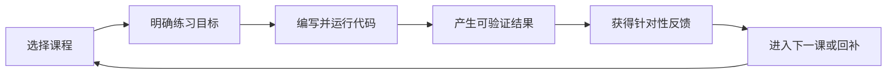
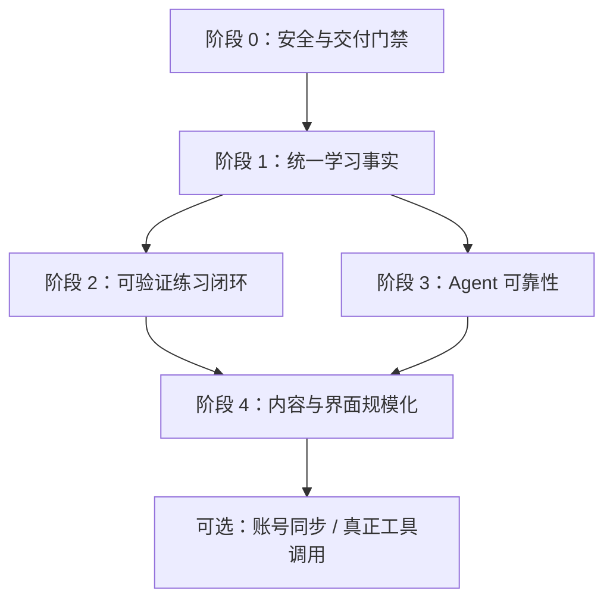

# Learn DA 后续迭代方向与路线图

> 制定日期：2026-07-14  
> 依据：[`project-review-2026-07-14.md`](project-review-2026-07-14.md) 与 [`agent-system-review-2026-07-14.md`](agent-system-review-2026-07-14.md)  
> 估算假设：1-2 名工程师，以两周为一个迭代；时间用于排序，不是承诺日期

## 1. 建议的产品方向

未来 2-3 个月的主线应定义为：

> **让学习者完成一次可验证的“理解 -> 编码 -> 运行 -> 反馈 -> 下一步”循环。**

不建议把“增加课程数量”“升级为多 Agent”或“接入更多基础设施”作为当前主线。现阶段最有价值的差异化，是把现有课程、Playground、Analytics、推荐和 Agent 接成一条可信学习链路。

### 北极星工作流

### 建议观测指标

| 层次 | 指标 |
| --- | --- |
| 激活 | 访问课程后进入 Playground 的比例 |
| 练习 | 启动练习、首次成功运行、完成练习的比例和耗时 |
| 学习 | 基于证据的课程完成率、回补后成功率、下一课接受率 |
| 留存 | 1 日/7 日回访、恢复未完成练习的比例 |
| Agent | 有帮助反馈率、fallback 率、解决报错率、每次有效帮助成本 |
| 平台 | p95 延迟、错误率、沙箱超时率、队列长度、存储增长 |

## 2. 排序原则

1. **安全先于体验**：任何会执行用户或模型代码的能力必须先 fail closed。
2. **事实先于智能**：没有可信学习事件，就不应继续优化推荐或能力评分。
3. **纵向切片先于横向扩展**：先让一条课程路径完全闭环，再扩更多主题。
4. **证据先于完成按钮**：课程完成应由可解释的练习证据支持。
5. **评测先于 Agent 自主性**：先能衡量回答质量，再考虑工具调用和多步执行。
6. **真实需求先于基础设施**：Redis、MinIO、Celery、账号系统只在明确需求出现时进入主线。

## 3. 阶段依赖

阶段 0 和阶段 1 是后续工作的硬依赖。阶段 2 与阶段 3 可以在 Learner State 接口稳定后部分并行。

## 4. 阶段 0：安全与交付门禁

**目标周期：1-2 个迭代**  
**目标：把项目从“只能可信内测”提升为“具备受控测试环境”。**

### 交付范围

#### 4.1 安全执行模块

- 生产环境强制 `SANDBOX_LOCAL_ENABLED=false`。
- 安全 runner 不可用时明确拒绝执行，不返回伪成功 mock。
- 将代码执行放入独立 worker/容器，不与 API 进程共享文件、环境变量或网络。
- 增加非 root UID、`pids_limit`、cap drop、`no-new-privileges`、输出大小限制和总超时。
- Agent 修复代码执行前要求用户确认，执行记录关联 request/attempt ID。
- 启动 readiness 检查真实 runner，而不只检查数据库。

#### 4.2 Web 信任边界

- 用成熟 Markdown parser + allow-list sanitizer 替换正则 HTML 直出。
- 拒绝原始 HTML、事件属性和危险 URL scheme。
- 生产启用 CSP、HSTS 和更完整的 Permissions Policy。
- `/docs`、`/openapi.json` 在生产关闭或受控开放。

#### 4.3 API 防滥用

- 为 Analytics、快照、推荐和 Dashboard 增加限流与输入长度约束。
- 快照列表增加分页和最大保留策略。
- 不再把 visitor ID 当授权；引入签名匿名会话 cookie 或服务端匿名 session token。
- 统一可信代理配置，修复 Nginx 后限流共享 IP 问题。

#### 4.4 交付门禁

- 建立 CI：后端测试、前端 type-check/build、Black、Mypy 基线、依赖审计。
- 先把 Black 收敛为 0；Mypy 可用 baseline 分批降到 0，但新增代码不得增加错误。
- 增加最小前端测试框架和 3 条关键契约测试：请求取消、Markdown 净化、多轮 Agent history。
- Docker production build 使用 `npm run build`，不能跳过 type-check。

### 验收标准

- 生产配置无法在 API 容器本地执行任意代码。
- runner 断开时 `/playground/execute` 返回明确 503，应用不回退到本地执行。
- 文件、网络、进程、fork bomb、超量 stdout 和 XSS 样例均有自动化拒绝测试。
- CI 在干净 checkout 可重复通过；格式和类型错误不可新增。
- Analytics 不能匿名无限写入，快照不能无限增长或一次性全部读取。

## 5. 阶段 1：统一学习事实

**目标周期：1-2 个迭代**  
**目标：让页面、看板、推荐和 Agent 对“学习者现在处于什么状态”得到同一个答案。**

### 交付范围

#### 5.1 Learner State 深模块

建立一个统一接口管理：

- 匿名学习者身份；
- 课程开始、尝试、成功、失败、完成和撤销；
- 当前草稿/快照引用；
- 最近学习位置；
- 按课程与路径读取的进度投影。

localStorage 可以继续作为离线缓存，但不再是服务器推荐的唯一事实源。同步时必须有版本、更新时间和冲突策略。

#### 5.2 可信事件模型

- `event_type` 改为枚举，不接受任意字符串。
- 每个事件包含 `event_id`/幂等键、occurred_at、lesson、attempt、status 和必要元数据。
- `code_run` 在执行完成后记录，并区分 success/error/timeout/rejected。
- 课程完成改为状态 upsert；撤销完成能更新投影，而不是追加另一个不可逆事实。
- 快照保存和 `code_save` 在同一事务中完成。

#### 5.3 推荐输入收口

- 推荐接口通过 learner session 读取完成状态，不接受客户端自报完整课程列表。
- `ai_help` 由 Agent 后端成功受理时记录。
- 推荐冷却写入数据库或 Redis，跨进程、重启后有效。
- 删除 Dashboard 对 deprecated 推荐接口的依赖，只保留一个推荐入口。

#### 5.4 数据修复

- 为现有事件建立一次性重算脚本。
- 对重复完成事件去重，明确无法恢复的历史语义。
- 暂时隐藏没有生成逻辑的能力雷达、新用户和时长指标，直到有可信定义。

### 验收标准

- 完成、撤销、再次完成在页面、推荐和 Dashboard 中完全一致。
- 相同事件重放不改变最终投影。
- 五次成功运行不会被解释为五次失败；错误类型可聚合。
- 任意客户端不能通过伪造 `completedLessons` 改变服务器推荐。
- 新旧数据迁移后，核心计数有可审计的重算结果。

## 6. 阶段 2：可验证练习闭环

**目标周期：2 个迭代**  
**目标：把“看过课程并勾选完成”升级为“完成了可验证任务”。**

### 交付范围

#### 6.1 课程练习规范

在课程 frontmatter 或独立练习文件中定义：

- 练习 ID、目标和初始代码；
- 允许的语言/运行环境；
- 可执行断言或输出 schema；
- 分级提示；
- 完成证据和可选拓展任务。

先选择 3 节课程作为 tracer bullet：Python 函数、Polars 基础、DuckDB SQL 基础。

#### 6.2 Playground 尝试模型

- 每次运行产生 attempt ID，并返回结构化验证结果。
- 区分代码执行成功和练习目标达成。
- 保存最近成功尝试和未完成草稿，支持恢复。
- 错误信息关联 Agent，上下文不再依赖复制全部页面状态。

#### 6.3 完成与反馈

- 练习通过后自动建议完成课程，仍允许用户查看证据后确认。
- 推荐使用最近尝试、错误类型和前置技能，而不是粗粒度运行次数。
- Dashboard 展示真实指标：已验证完成、尝试次数、常见错误、恢复中的练习。

#### 6.4 编辑器决策

本阶段建议正式接入 Monaco，因为 Playground 是产品核心交互且依赖已经存在。若不准备维护 Monaco，应删除依赖并同步修改 README，不能继续保留虚假能力声明。

### 验收标准

- 3 节样板课程可从进入课程到验证完成全流程运行。
- “Python 进程退出码为 0”与“练习通过”在数据模型和 UI 中明确区分。
- 刷新或跨页面后可恢复未完成尝试。
- 至少 80% 的样板练习结果可由确定性断言判定，不依赖 LLM 主观评分。

## 7. 阶段 3：Agent 可靠性与教学效果

**目标周期：1-2 个迭代**  
**目标：让 Agent 成为学习证据的解释器和教练，而不是独立的文本功能。**

### 交付范围

- 修复 history 合约，支持至少 20 轮稳定对话且不重复当前消息。
- 真正传播 AbortSignal；需要逐 token 体验时增加 SSE。
- LLM client、课程检索器和 embedding 索引在 lifespan 中复用。
- embedding 按课程内容哈希持久化，内容不变时不重复生成。
- 沙箱执行移出事件循环，增加 timeout、有限重试和错误分类。
- Agent 自动读取当前 lesson、attempt、错误类型和验证结果。
- 建立 30-50 条离线评测：意图路由、知识召回、修复成功、提示优先和下一步建议。
- 记录 route、retrieval mode、token、延迟、fallback reason、verification 和用户反馈。

### 暂不引入 Function Calling 的条件

只有同时满足以下条件，才进入真正工具调用评估：

1. 存在至少 5 个必须由模型自主选择工具才能解决的真实场景；
2. 单次文本回答无法稳定解决；
3. 工具权限、参数 schema、最大步骤、审计和成本预算已定义；
4. 离线评测能够证明收益大于复杂度。

### 验收标准

- 20 轮对话、取消、429、模型超时和 fallback 均有 E2E 覆盖。
- Agent 修复建议的沙箱验证成功率和失败原因可统计。
- 相同课程版本的 embedding 只构建一次。
- 每个模型请求可通过 request ID 关联用户动作、检索、成本和最终结果。

## 8. 阶段 4：内容与界面规模化

**目标周期：1-2 个迭代，随后持续进行**  
**目标：让新增主题和修改核心页面不再依赖理解数千行文件。**

### 交付范围

#### 8.1 Content Catalog 深模块

- 启动/构建时一次性加载课程，按内容版本缓存。
- 用 Pydantic schema 验证 catalog 和 frontmatter。
- 校验 slug/id 唯一、track/category 存在、prerequisite/recommended_next 引用有效、课程图无非法环。
- 提供内容 lint 命令和本地预览。
- 内容错误阻断发布，不在运行时静默跳过。

#### 8.2 前端模块加深

优先按工作流拆分，不按视觉碎片过度拆分：

- `useLessonSession`：课程加载、完成状态、推荐刷新和事件写入。
- `usePlaygroundSession`：草稿、attempt、执行、快照和结果选择。
- `RecommendationPanel`：统一三处建议样式和行为。
- `AgentConversation`：状态与请求生命周期；embedded/floating 只保留布局适配。
- 页面只组合这些接口，不直接重复数据请求和样式映射。

#### 8.3 删除失效基础设施

- 删除或隔离未使用的 MinIO、Celery、邮件、Paramiko、Gevent 依赖。
- 二选一保留 SlowAPI 或 Redis 全局限流，不维护两套实现。
- 删除后端目录的 ECharts `package.json`。
- Redis 只在有持久冷却、队列或缓存的真实用例后保留为生产依赖。

### 验收标准

- 新增一条学习 track 只需内容与 catalog 变更，不修改页面硬编码。
- 内容错误在 CI 中给出文件和字段级错误。
- 最大 Vue 页面显著缩小，核心工作流可通过 composable 测试驱动。
- 生产依赖都能映射到一个当前运行时用途。

## 9. Later 与明确延后事项

### 有指标后再考虑

- 登录、跨设备同步和团队/班级管理；
- PostgreSQL/MySQL 迁移和水平扩容；
- 多模型路由、rerank 和回答缓存；
- 真正 Function Calling、ReAct 或多 Agent；
- 教师端内容管理后台；
- 大规模课程市场或插件系统。

### 当前明确不做

- 在不可信事件上继续增加复杂推荐权重；
- 用 LLM 代替确定性练习判定；
- 为未来假设提前引入消息队列、对象存储和微服务；
- 在没有评测集前追求更长 prompt 或更多模型调用；
- 在安全 runner 未完成前扩大 Playground 公网流量。

## 10. 首批执行清单

建议按以下顺序建立工作项，每项都应独立测试和评审：

1. 生产执行 fail-closed 与独立 runner。
2. Markdown 净化、CSP 和 XSS 回归测试。
3. CI 基线：测试、type-check/build、Black、Mypy baseline。
4. Analytics/快照限流、分页和签名匿名 session。
5. 新学习事件 schema 与幂等写入。
6. 完成/撤销统一状态和投影重算。
7. 运行完成后记录 attempt outcome，修正推荐困难信号。
8. 持久推荐冷却、Agent `ai_help` 和单一推荐接口。
9. 三节样板课程的确定性练习验证。
10. 修复 Agent 多轮/取消并接入 attempt 上下文。
11. 建立 Content Catalog 校验与缓存。
12. 拆分 Playground、LessonDetail、AgentPanel 的工作流模块。

## 11. 阶段完成定义

每个阶段只有同时满足以下条件才算完成：

- 用户工作流在桌面与移动端完成手测，并有关键 E2E；
- 后端单元/集成测试、前端测试、类型检查和生产构建通过；
- 安全、数据迁移、回滚和可观测性有明确验证；
- README、环境示例、OpenAPI 和实际行为一致；
- 不增加未被当前工作流使用的基础设施或依赖；
- 指标能够回答该阶段是否改善了学习结果或系统风险。

## 12. 方向结论

项目下一阶段的核心不是“把 Agent 做得更像 Agent”，而是把 **学习证据** 做成平台的中心。安全执行提供可信运行环境，Learner State 提供可信事实，可验证练习产生学习证据，推荐与 Agent 再基于这些证据给出反馈。

沿这条顺序迭代，现有模块大多可以保留并加深；跳过前两阶段直接增加 AI 或内容，只会把当前的数据、安全和维护问题放大。
