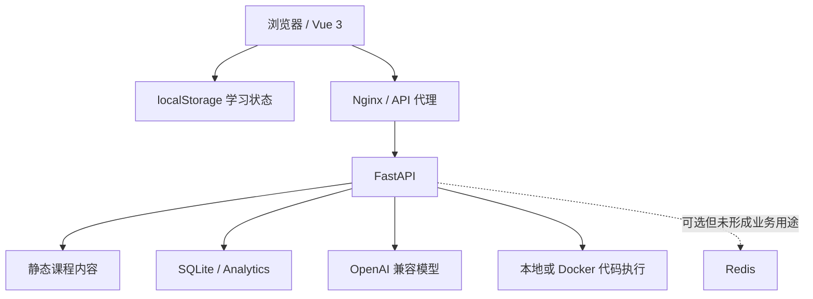
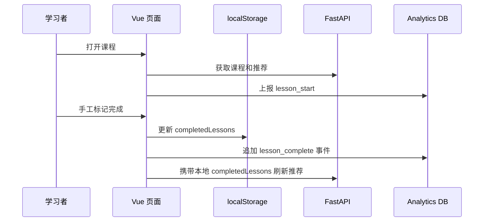

# Learn DA 完整项目审查报告

> 审查日期：2026-07-14  
> 审查基线：`main` / `5f1f1b8`  
> 审查范围：产品闭环、前端、后端、内容、数据、Agent、代码执行、安全、部署、测试和工程治理  
> Agent 专项审查：[`agent-system-review-2026-07-14.md`](agent-system-review-2026-07-14.md)

## 1. 执行摘要

Learn DA 已经具备一个可演示的完整学习产品外形：课程目录、课程详情、Playground、代码快照、学习进度、规则推荐、学习看板和 AI 教学助手都能从页面进入。内容层也已经从单一 Polars/DuckDB 站点向 catalog 驱动的多主题平台演进。

但当前成熟度仍是 **内部 Alpha**，还不是可公开部署的 Beta。最主要的限制不是页面或功能数量，而是四个基础闭环尚未成立：

1. **执行安全未闭环**：生产默认仍在主后端容器执行不可信 Python，安全检查可绕过。
2. **学习事实未统一**：浏览器本地进度和服务器 Analytics 各自维护状态，完成数、推荐与看板会逐渐分叉。
3. **学习结果未验证**：课程完成主要靠手工勾选；代码运行次数没有成功/失败语义，却被推荐规则当作困难信号。
4. **工程交付未设门禁**：没有 CI、前端测试或统一 lint；当前 Black 检查有 37 个文件不合规，Mypy 有 65 个错误。

因此，后续不应优先增加更多课程类型、多 Agent 或复杂推荐算法。正确方向是先建立“安全执行 -> 可信学习事件 -> 可验证练习 -> 个性化反馈”的纵向闭环。

## 2. 项目现状

### 2.1 产品功能

| 领域 | 已实现能力 | 当前限制 |
| --- | --- | --- |
| 内容 | 2 个 topic、4 条 track、13 节课程、4 个示例；Markdown + YAML frontmatter | 缺少发布前 schema/引用图校验和内容预览流程 |
| 学习中心 | 分类、难度、关键词过滤；继续学习；规则推荐 | 进度来自 localStorage，跨设备不可用，与后端看板不一致 |
| 课程详情 | 目录、正文、示例、完成标记、快照、下一步建议 | 完成标记不验证练习结果，撤销完成不会回滚服务器统计 |
| Playground | Python 执行、输出、DataFrame 预览、历史、草稿、快照 | 实际为 textarea，不是 README 声称的 Monaco；生产执行不安全 |
| Agent | 问答、解释、修复、练习、推荐解释、fallback | 是规则路由单次 LLM，不是 Function Calling；多轮和可观测性有缺陷 |
| Analytics | 学习事件、用户画像、每日趋势、快照、分类进度 | 事件不可信且不幂等，多项看板字段从未计算 |
| 部署 | 前后端 Docker、Nginx、SQLite、可选 Redis/沙箱配置 | Redis 与 Docker 沙箱按示例配置无法可靠启用，缺少安全默认值 |

### 2.2 技术结构

当前有两个并行的学习状态源：

- localStorage：完成课程、最后访问、偏好、Playground 草稿；用于大部分页面和推荐请求。
- SQLite Analytics：完成事件、运行次数、AI 求助、快照和看板投影；通过 visitor ID 关联。

两者没有同步协议或冲突规则，这是当前产品数据问题的根源。

### 2.3 代码规模

- 前端 `25` 个 TypeScript/Vue 文件，共约 `8,759` 行。
- 前端最大的 5 个文件占 `66.3%`：`Playground.vue` 1,787 行、`LessonDetail.vue` 1,417 行、`AgentPanel.vue` 981 行、`Learning.vue` 971 行、`Dashboard.vue` 654 行。
- 后端 `62` 个 Python 文件，共约 `7,126` 行；最大模块是 968 行的推荐规则和 643 行的 Redis 客户端。
- `components/editor` 与 `components/common` 为空，主要交互实现仍集中在页面模块。

## 3. 关键工作流审查

### 3.1 学习路径

问题在于 `lesson_complete` 是只追加事件。用户取消完成时只修改 localStorage，不写撤销事件；再次完成又追加一次。推荐主要信任浏览器列表，看板主要信任服务器聚合，两者自然出现不同结果。

### 3.2 Playground

前端在真正执行前先上报 `code_run`，后端事件没有 `status`、`error_type` 或 `execution_id`。推荐规则却把累计 `codeRuns` 描述为“多次运行失败”。因此五次成功实验也可能触发“基础薄弱”的回补建议。

代码执行由 [`SandboxService`](../app/sandbox/service.py#L14) 选择本地子进程或 Docker。开发方便性已经实现，但生产 Compose 默认仍选择本地 runner，且正则黑名单不能作为 Python 安全边界。

### 3.3 推荐与看板

规则推荐的优先级“回补 -> 分支 -> 回流 -> 顺学”清楚，模型只负责解释建议，这个方向合理。但输入数据存在以下问题：

- `ai_help` 没有由 Agent 请求写入。
- 回补冷却保存在每请求创建的内存实例中。
- 运行事件不区分成功与失败。
- 完成状态同时来自客户端参数和历史事件。
- 能力雷达五个分数字段从未更新，长期显示 0。
- `new_users`、学习时长和平均会话时长没有完整采集链路。
- Dashboard 同时请求旧版 deprecated 推荐和新版规则推荐，展示逻辑重复。

### 3.4 内容扩展

catalog 驱动方向成立，category 类型也已放宽为字符串。但内容加载器会在每个新 repository 中重新扫描 Markdown；repository 又按请求创建。加载失败仅打印并跳过，路由仍可启动。对于内容平台，更合适的接口是“启动时构建并验证一个不可变内容索引”，而不是让每个请求面对文件系统和部分失败。

## 4. 架构评价

### 4.1 已形成的深模块

- `LearningService` 对调用方提供较小的课程查询接口。
- `AgentService` 把路由、检索、prompt、LLM 和验证隐藏在四个入口后面。
- `RecommendationService.get_recommendation()` 保持一个清晰的规则决策入口。
- `SandboxService.execute()` 提供统一 runner 选择接口。

这些模块已经有一定深度，外部接口比内部实现小，测试也能通过依赖注入跨过同一接口。

### 4.2 需要加深的模块

| 候选模块 | 当前摩擦 | 建议的深层接口方向 |
| --- | --- | --- |
| Learner State | localStorage、事件表、画像、推荐参数各自表达进度 | 一个可信的学习状态接口，统一完成、撤销、尝试和读取投影 |
| Execution | Playground 与 Agent 都可触发执行，安全和异步策略散落 | 一个 fail-closed 的执行接口，隐藏 worker、限额、输出截断和审计 |
| Content Catalog | loader/repository/recommendation/retriever 重复加载课程 | 一个启动时验证、缓存、按版本发布的内容索引 |
| HTTP Client | 去重、取消、错误映射都在一个薄封装中但语义不完整 | 一个明确的请求生命周期接口，区分去重、取消与幂等 |
| Learning UI | 页面模块承担数据、状态、模板、响应式布局和样式 | composable 负责工作流，展示模块通过稳定 props/emit 接口复用 |

### 4.3 浅模块和失效代码

- `AnalyticsService` 多数方法只是 repository 传递层，却没有集中事件不变量或事务语义。
- 自定义 Redis 限流中间件与 SlowAPI 同时存在，实际只启用了后者。
- Redis 客户端约 800 行，但除启动/健康检查外没有业务调用。
- MinIO、Celery、邮件、Paramiko、Gevent 等依赖或模块没有进入当前产品工作流。
- 后端目录存在独立 `package.json`，仅重复声明前端已安装的 ECharts。
- `session_id` 和 SQL execute contract 已声明但没有实现对应行为。

## 5. 做得较好的部分

- 内容已经从固定专题向 catalog 配置演进，并有现有课程图的单元测试。
- 前后端统一使用 camelCase 响应模型，接口类型总体可追踪。
- 推荐排序保持规则化，避免让生成模型直接控制课程路径。
- 无 LLM 时 Agent 有确定性 fallback，核心学习入口不会完全失效。
- Playground 可以提取 Polars/Pandas DataFrame 的结构化预览。
- 路由懒加载、Dashboard 单独加载 ECharts，基础前端分包合理。
- 后端已有请求 ID、访问耗时、统一响应和异常处理框架。
- 79 项后端测试覆盖了健康检查、课程、Playground、Agent 和推荐主分支。

## 6. 问题清单

严重度：P0 阻断公开生产；P1 应在下一发布阶段解决；P2 影响质量、成本或演进效率。

| ID | 严重度 | 问题 | 主要影响 |
| --- | --- | --- | --- |
| P-01 | P0 | 生产默认本地执行不可信 Python，正则黑名单可绕过 | 密钥、SQLite、代码和网络可被访问 |
| P-02 | P1 | Agent/课程 Markdown 未净化后进入 `v-html`，CSP 未启用 | XSS、危险链接和模型输出注入 |
| P-03 | P1 | Analytics 与快照接口无认证、无专属限流，快照可写 50KB 且列表无分页 | 数据污染、隐私边界不清、存储与响应 DoS |
| P-04 | P1 | 完成状态双轨且事件不幂等，撤销完成不回滚服务器投影 | 看板、推荐和本地页面互相矛盾 |
| P-05 | P1 | `code_run` 在执行前记账且无结果字段，推荐把运行数当失败数 | 回补建议误判，无法度量练习质量 |
| P-06 | P1 | Agent 普通对话第 4 轮 history 超限，当前消息又重复发送 | 核心对话稳定失败和 token 浪费 |
| P-07 | P1 | Playground/Agent 沙箱同步调用阻塞事件循环，输出没有显式上限 | 并发退化、内存/日志 DoS |
| P-08 | P1 | embedding、课程 repository 和部分客户端按请求重建 | 延迟、上游费用和日志噪声放大 |
| P-09 | P1 | 生产部署开关不闭环：Redis 使用未被 Settings 消费的 `REDIS_URL`，Docker 沙箱未连接 daemon | 可选能力按示例配置无法工作 |
| P-10 | P1 | 无 CI；Black 检查 37 个文件失败，Mypy 65 个错误，前端无测试 | 变更没有可重复的质量门禁 |
| P-11 | P1 | 能力雷达、学习时长、新用户等看板数据没有生成逻辑 | 页面展示看似完整，数据长期为占位值 |
| P-12 | P1 | Playground 实际是 textarea，Monaco 依赖未使用；SQL 被 schema 接受但仍作为 Python 执行 | 产品承诺与真实能力不一致 |
| P-13 | P2 | 通用请求 key 忽略 POST body，外部 AbortSignal 又被内部 signal 覆盖 | 不同 POST 互相取消，停止请求无效 |
| P-14 | P2 | 前端 66.3% 代码集中在 5 个文件，多处复制推荐样式和响应式模板 | 修改成本高，难做组件/工作流测试 |
| P-15 | P2 | 自动路由注册捕获 import 异常后继续启动 | 生产可在业务模块缺失时假健康 |
| P-16 | P2 | 内容 YAML/引用错误被静默跳过，缺少唯一性和图一致性发布门禁 | 新主题扩展容易产生运行时缺课或断链 |
| P-17 | P2 | README 声称 Monaco、Function Calling、Redis 缓存和安全沙箱，与实现不一致 | 错误指导使用者和后续开发者 |
| P-18 | P2 | 大量未使用依赖、Redis/MinIO/限流基础设施和后端 ECharts 包残留 | 镜像、攻击面、维护与类型检查成本增加 |

P-01、P-02、P-06 的详细调用链和复现证据见 Agent 专项报告。P-03 还意味着当前 visitor ID 只是客户端生成的伪身份，不应被当作访问授权。

## 7. 工程验证结果

| 检查 | 结果 |
| --- | --- |
| 后端测试 | `79 passed` |
| 前端类型检查 | `vue-tsc --build` 通过 |
| 前端生产构建 | Vite 构建通过 |
| Black | 失败，37 个文件需要格式化 |
| Mypy | 失败，63 个 source 中 15 个文件共 65 个错误 |
| 前端自动化测试 | 无测试文件和测试脚本 |
| CI / pre-commit | 未发现配置 |
| E2E / 安全 / 并发测试 | 未发现 |

测试通过说明现有断言覆盖的行为稳定，不代表生产安全、数据语义或用户完整工作流已经正确。

## 8. 成熟度判断

| 领域 | 当前阶段 | 进入公开 Beta 前的门槛 |
| --- | --- | --- |
| 课程内容 | Alpha/Beta 之间 | 内容 schema、引用图和发布预览 |
| 学习体验 | Alpha | 可验证练习与统一进度 |
| Playground | 原型 | 隔离执行、编辑器能力、结果事件 |
| Agent | Alpha | 多轮修复、错误观测、成本和质量评测 |
| Analytics | 原型 | 可信事件、幂等投影、真实指标 |
| 部署运维 | 开发环境 | 安全默认值、CI、readiness、备份和监控 |

## 9. 最终结论

项目的正确价值核心不是“一个带 AI 的课程网站”，而是“课程内容、可执行练习、学习证据和教学反馈在同一工作流中闭环”。当前已经拥有实现这个方向所需的大部分页面和后端模块，但它们之间的事实模型与安全接口尚未收口。

建议暂停横向增加功能，先完成安全执行与 Learner State 两个深模块，再把课程完成从手工勾选升级为可验证学习结果。具体迭代顺序见 [`iteration-roadmap-2026-07-14.md`](iteration-roadmap-2026-07-14.md)。
