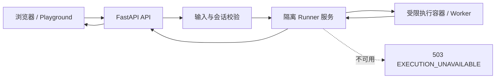

# 安全执行与交付门禁设计 Spec

> 日期：2026-07-14  
> 状态：已确认，待实施计划  
> 范围：迭代路线图阶段 0 的第一交付包  
> 相关审查：[项目审查](../../project-review-2026-07-14.md)、[Agent 专项审查](../../agent-system-review-2026-07-14.md)、[迭代路线图](../../iteration-roadmap-2026-07-14.md)

## 1. 目标与决策

本交付包将 Learn DA 从“只能在可信内测中运行”的代码执行模式，提升为“可以在受控测试环境中运行”的模式。首要目标是让生产 API 不能直接执行任何用户或模型产生的代码，并为公开部署建立可重复验证的质量门禁。

已经确认的产品和架构决策如下：

1. 生产环境保留 Playground 的执行能力。
2. 代码只能由独立的隔离 Runner 执行；FastAPI API 进程不得创建本地代码子进程。
3. Runner 不可用时，执行请求必须明确失败并返回 `503`，不得回退到本地执行、弱隔离执行或 mock 成功。
4. Agent 只能生成待执行的候选代码。用户必须在 Playground 明确触发执行，系统记录完整的执行来源和结果。
5. 匿名访问使用签名、`HttpOnly`、`Secure` 的 session cookie；客户端不再把可任意伪造的 `visitor_id` 作为授权身份传给服务端。

## 2. 范围

### 2.1 本包包含

- 独立、受限的代码执行 Runner 与生产环境配置收口。
- 执行 API 的请求、结果、错误和审计契约。
- Markdown/LLM 输出、匿名会话、限流、快照和生产安全响应头的信任边界加固。
- Liveness/readiness 拆分与 Runner 可用性检查。
- CI、格式与类型债务基线、依赖审计及关键安全契约测试。
- 对 Playground 的受控失败状态提示。

### 2.2 本包不包含

- 统一学习状态、课程完成事件重构、推荐规则重写。
- Monaco 编辑器、可验证练习与学习路径体验改造。
- Agent 工具调用、SSE、登录账号和跨设备同步。
- Redis、Celery 或账号服务的大规模基础设施迁移。

这些事项在本包完成后，分别进入“统一学习事实”和“简化学习主路径”两个独立 Spec/Plan。

## 3. 执行架构

### 3.1 API 的职责

API 只负责以下工作：

- 验证匿名会话、限流、语言和代码长度；
- 接收客户端 `request_id`，生成唯一 `execution_id`；
- 调用 Runner 并将标准化结果返回给调用方；
- 保存最小必要审计信息，包括会话、`request_id`、`execution_id`、发起来源和最终状态；
- 将执行状态作为后续学习事件的可信输入。

API 不读取或执行提交代码，不调用 `subprocess`，也不提供任何本地执行 fallback。生产启动配置必须强制 `SANDBOX_LOCAL_ENABLED=false`；该值为真时应用拒绝以生产模式启动。

### 3.2 Runner 的职责与约束

Runner 是 API 外部的独立 HTTP 服务，负责将一次执行放入短生命周期的受限容器/worker。执行提供者（Docker、远程容器运行时或后续的专用 sandbox 服务）的访问凭据只能配置在 Runner 内，绝不进入 API 容器。每次执行必须满足：

- 非 root UID；
- 默认无网络；
- 只读根文件系统和隔离的临时工作目录；
- 删除 Linux capabilities，并启用 `no-new-privileges`；
- PID、CPU、内存、总时长与 stdout/stderr 总量上限；
- 到期后强制终止并清理执行环境；
- 不挂载 API 源码、宿主机 Docker socket、数据库文件、密钥或环境变量。

Runner 仅接受显式定义的执行输入和资源预算，并只返回标准化执行结果。它不得成为可泛化的命令执行代理。

### 3.3 执行契约与失败语义

执行接口必须在请求和响应中支持以下字段：

| 字段 | 语义 |
| --- | --- |
| `request_id` | 客户端生成的请求关联 ID，用于重试和前端去重。 |
| `execution_id` | 服务端生成的唯一执行 ID，用于审计和后续学习事件。 |
| `source` | `playground` 或 `agent_suggested`，后者仍需用户显式确认。 |
| `status` | `success`、`error`、`timeout`、`rejected`、`unavailable` 之一。 |
| `error_type` | 仅在非成功时提供的稳定错误分类。 |
| `stdout` / `stderr` | 经大小限制和脱敏处理后的输出。 |
| `duration_ms` | Runner 测得的执行耗时。 |

Runner 不可用、健康检查失败或调用超时，API 返回 HTTP `503` 与 `status=unavailable`。输入不合法或被策略拒绝返回 `4xx` 与 `status=rejected`。用户代码报错和运行超时是已受控的执行结果，返回 HTTP `200`，但其 `status` 分别为 `error` 或 `timeout`。这样客户端、Analytics 和 Agent 能区分系统故障与学习过程中的代码问题。

### 3.4 Agent 边界

Agent 可以解释错误和生成候选修复代码，但没有直接执行权限。候选代码必须进入 Playground，由用户明确触发执行。执行审计的 `source` 标记为 `agent_suggested`，并关联产生候选代码的 Agent 请求 ID。

## 4. Web 与 API 信任边界

### 4.1 富文本安全

课程 Markdown 和所有 LLM 文本经过同一套成熟 Markdown parser 与 allow-list sanitizer 后才渲染。默认拒绝：

- 原始 HTML；
- 事件属性、内联样式、iframe 和表单；
- `javascript:`、`data:` 及其他危险 URL scheme；
- 未在 allow-list 内的标签和属性。

前端不得将原始课程、API 或 LLM 文本直接传给 `v-html`。净化逻辑必须有 XSS 回归测试。

### 4.2 会话、限流与存储治理

以签名、`HttpOnly`、`Secure` 的匿名 session cookie 取代把任意 `visitor_id` 当作授权凭据的做法。Analytics、快照、推荐和 Dashboard 使用同一个会话识别接口，并应用：

- 路由级限流；
- 请求体、代码、消息和 metadata 字段的长度限制；
- 快照列表分页；
- 单匿名会话和全局的快照保留上限与清理策略；
- 可信代理配置，使反向代理后的限流按真实客户端而非共享 IP 工作。

本包不引入登录账号。匿名 session 的目标是防止伪造、无限写入和任意读取，不是实现跨设备身份体系。

### 4.3 生产 HTTP 与文档面

生产环境启用 CSP、HSTS、`X-Content-Type-Options`、`Referrer-Policy` 和 `Permissions-Policy`。开发环境只能为本地热更新等必要能力放宽配置。`/docs` 和 `/openapi.json` 在生产默认关闭，只有明确的受控配置才能开放。

## 5. 健康、可观测性与交付门禁

### 5.1 健康检查

- `liveness`：仅验证 API 进程仍能响应；不检查外部依赖。
- `readiness`：验证数据库可访问、配置合法且 Runner 健康；任一失败均标记为未就绪，不接受执行流量。

日志与指标至少记录：Runner 可用性、`execution_id`、状态、错误分类、耗时、输出截断、来源和被拒绝原因。日志不得保存完整代码、密钥或未经脱敏的用户数据。

### 5.2 CI 门禁

CI 在干净 checkout 中运行以下项目：

1. 后端测试。
2. 前端 type-check 与生产 build。
3. Black 格式检查，先将现有问题收敛为零。
4. Mypy 基线检查；存量错误单独记录，新增/修改代码不得增加错误数量。
5. 依赖审计。
6. 安全和接口契约测试。

生产 Docker 构建必须调用项目标准 `npm run build`，不得通过跳过 type-check 的替代命令绕过门禁。

## 6. 验收标准

### 6.1 必须自动验证

- 在生产配置下，API 进程无法执行任何本地用户或模型代码。
- Runner 不可用、超时或 readiness 失败时，执行接口返回明确的 `503/unavailable`，不存在本地或 mock fallback。
- 文件访问、网络访问、进程滥用、超量输出、执行超时和资源限制样例均被受控拒绝或终止。
- 典型 Markdown/LLM XSS 载荷无法产生脚本、事件属性或危险链接。
- 无有效匿名 session 的接口访问被拒绝；同一 session 的限流、快照分页和保留策略可测试。
- 多轮 Agent history、请求取消和 Markdown 净化保留前端契约测试。

### 6.2 人工验证

- Playground 对 `error`、`timeout`、`rejected` 和 `unavailable` 呈现不同且可理解的反馈；不误称为成功。
- Agent 生成的修复代码必须经用户显式操作才能执行，执行记录显示其来源。
- 干净环境中 CI 可重复通过，格式问题为零，类型债务不因本包扩大。

## 7. 风险与非目标

容器隔离不是万能安全边界；Runner 所在宿主仍需使用受控的镜像来源、运行时补丁和基础设施权限。首版目标是消除 API 本地任意执行和明显的 Web/API 信任边界问题，不承诺对抗拥有宿主机权限的攻击者。

本包也不以新增功能数量为成功指标。执行 API 稳定但明确地拒绝不可用请求，比不可靠的本地 fallback 更符合学习产品的信任要求。

## 8. 后续依赖

本包完成后，下一份 Spec 将定义“统一学习事实”：将 `execution_id`、`status` 和 `error_type` 作为可审计学习事件的输入，并使课程页、推荐、Dashboard 和 Agent 读取一致的学习状态。
